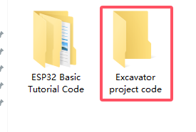
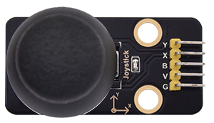
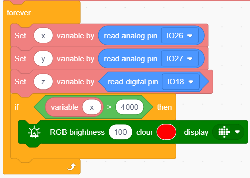
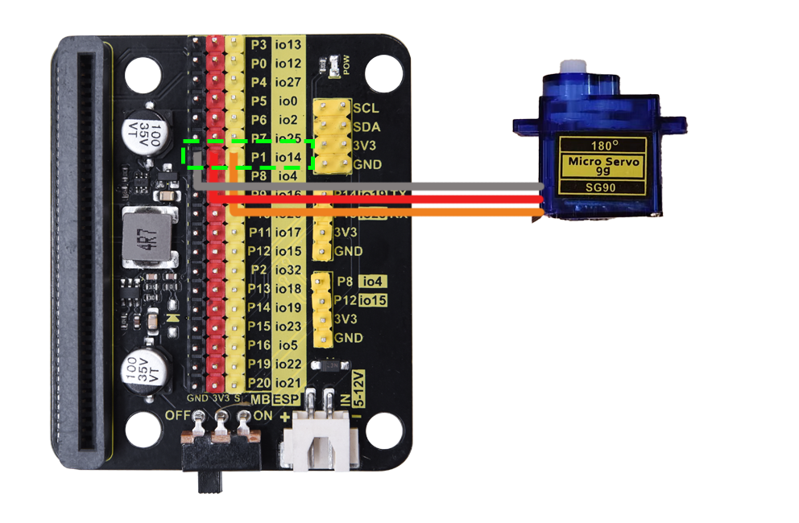
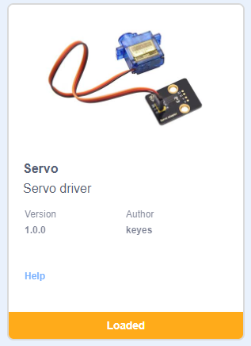

# ESP32 Easy Coding Board Excavator

## 1. Projects

[Code Download](./Codes.zip)

----------

### 1. Capacitive Touch Module

#### 1.1 Overview

Capacitive touch module is an input component which is widely used in electronic devices such as computers, mobile phones and even home appliances. It converts the physical button operation into electrical signals for recognition and processing. This module is usually composed of a touch switch, a contact pad, a conductive material and a circuit board.

#### 1.2 Schematic Diagram

TTP223N-BA6 is a touch pad detector IC that comes with a touch area. The touch detection IC, with various dimensions, can replace the traditional buttons. Its output mode is related to pins TOG and AHLB.

| TOG  | AHLB |      Optional Function of Pin Q      |
| :--: | :--: | :----------------------------------: |
|  0   |  0   | Direct mode, available at high level |
|  0   |  1   | Direct mode, available at low level  |
|  1   |  0   |  Trigger mode, power-on state is 0   |
|  1   |  1   |  Trigger mode, power-on state is 1   |

From the Schematic Diagram, the pin TOG and AHLB are suspended, so the output of this module is direct mode which is available at high level.

When we touch the area on the module (equivalent to pressing the button), the signal S outputs high and the on-board red LED lights up. We can determine whether the capacitive touch module is working by reading the power level of S terminal.

After powering on, it takes about 0.5 seconds for stabilization. During this period, please do not touch this area, because all functions are disabled at this time and self-calibration is always carried out. The calibration period is about 4 seconds.

------

#### 1.3 Parameters

- Operating voltage: DC 3.3 / 5V
- Operating temperature: -10°C ~ +50°C
- Output signal: digital signal
- Dimensions: 32 x 24 x 7.3 mm
- Positioning hole: diameter of 4.8 mm
- Interface: 3 pin spacing 2.54 mm

------

#### 1.4 Wiring Diagram

#### 1.5 Test Code

1. In , add a .
2. In , add  and set baud rate to `9600`.
3. In , put  under .

4. In , drag  and put it into .
5. In , add  and set pin to IO19, put it into the primt box of .
6. For convenience, in , add a  and set delay to 0.3S.

**Complete code:**

**Test result:**

After uploading code, the value of the module will be displayed on the printing box of KidsBlock Desktop. When the sensor is touched, the value is `0`. Release the sensor and the value becomes `1`. 

Click  to show the printing box.

#### 1.5 Expansion Code

Capacitive touch sensor control RGB LED matrix.

1. In , add a .
2. In , add  under .
3. In , put  under .
4. In , put  into .
5. In , add  and set pin to IO19, and put it into the condition box of .

6. In , add a , click  to set the color to red . Click  to change it to . Put it into “then” of .
7. In , add a , click  to set the color to red . Set the display icon to . Put it into the “else” of .

**Complete code:**

**Test result:**

After uploading code, ESP32 Easy Coding Board shows  on its LED matrix when the sensor is not touched. When you touch the sensor, it displays .

-------------

### 2. Joystick Module

#### 2.1 Overview

Joystick module is able to control and input signals, which is commonly used for remote control devices, game controllers, and robotics. It detects the displacement and direction to generate corresponding analog signals, so as to control external equipment.

#### 2.2 Schematic Diagram

When the joystick is used as a current regulator in a DC circuit, the current will pass through the arm of the module, and the current will increase due to anodic oxidation. In this case, it is recommended to connect the resistor end to the negative and the arm to the positive. 

If the DC current passes directly through the module, its anode will be oxidated so as to increase its impedance. Therefore, it is best to connect the current negative to the terminal with the carbon diaphragm, and the positive to the terminal with joystick contact piece. 

When it is used as a variable resistor, it is recommended to use as a voltage divider. When adjusting the voltage in a regulator, rotate clockwise to increase output voltage, while rotate counterclockwise to decrease output voltage. Besides, its load resistance RL should not be less than 10 times the nominal resistance RT. 

#### 2.3 Parameters

- Operating voltage: DC 3 ~ 5V 

- Operating temperature:-10°C ~ +50°C

- Dimensions: 47.6MM *23.8MM
- Interface: 5PIN interface
- Analog signal output: signal terminal X, Y
- Digital signal output: signal terminal B

#### 2.4 Wiring Diagram

#### 2.5 Test Code

**Test Code**

1. In , add a .
2. In , add  and set the baud rate to `9600`.
3. In , put  under .

4. In , drag  and set print message to “X:” and mode to `no-warp`, and put it into .
5. In , drag and set mode to `no-warp`, and put it into .
6. In , drag  and set pin to `IO26`, and put it into the print box of .

7. Put mouse on  to `Duplicate`:

8. Modify the x in  into “    Y:” and pin in  into `IO27`.

9. Put the mouse on  to `Duplicate`.
10. Modify the y in  into “   Z:” and replace  with  and set the pin to `IO18`

4. In , add a  and set to 0.1 seconds.

**Complete code:**

**Test result:**

After uploading code, the analog and digital values of the joystick will be displayed on the printing box of KidsBlock Desktop. Rotate the module and the values change (Range: 0-4095). 

Click  to show the printing box.

#### 2.6 Expansion Code

Joystick controls the brightness of RGB LED matrix.

**Expansion Code**

1. In , add a .
2. In , put  under .
3. In , add three  and set name to `x,y,z` respectively, and put it under .
4. In , put  under .

5. In , add three  and modify the name to `x,y,z`, put it into .
6. In , drag  and set the pin to `IO26`, and put it into the last box of .
7. In , drag  and set the pin to `IO27`, and put it into the last box of.
8. In , drag  and set the pin to `IO18`, and put it into the last box of.

9. In , put  under .
10. In , put  into the condition box of .
11. In , drag a  and name it to `x`, put it into the left box of  and modify the right box to `4000`.
12. In , drag  and click  to set the color to red . Click  to set it to . Put it into .

9. Duplicate . Replace  with , and modify the number to `100`, and change the icon  to .

10. Again, duplicate , and modify the two variable  to `y`, and set `y > 4000` to show  and `y < 100` to show .

11. Copy , replace  with , set the condition to `z = 1`, and set the matrix icon to .

**Complete code:**

**Test result:**

After uploading code, the matrix will show the corresponding arrow when you pull the joystick to a certain direction. Press the joystick to clear the matrix display. 

-----------------

### 3. Servo

#### 3.1 Overview

The servo is a kind of position servo driver, which is mainly composed of housing, circuit board, core-less motor, gear and position detector. The receiver or microcontroller sends a signal to the servo which has an internal reference circuit that generates a reference signal with a period of 20ms and a width of 1.5ms, and compares the DC bias voltage with the voltage of the potentiometer to output voltage difference.

There are many specifications of servos, yet all contains three colors of wires: brown, red and orange. Brown is the grounded, red is the positive, and orange is signal. The wire colors may vary from brands.

The rotation Angle of the servo is controlled by adjusting the duty cycle of the PWM (pulse width modulation) signals. Theoretically, the period of the standard PWM signal is fixed at 20ms (50Hz), so the pulse width should be 1ms ~ 2ms. But in fact, it is 0.5ms ~ 2.5ms, corresponding to the servo angle of  0° ~ 180°.

#### 3.2 Parameters

- Operating voltage: DC 3.3 ~ 5V

- Operating Angle range: approx. 180°(at 500→2500 μsec)
- Pulse width: 500→2500 μsec
- No load speed: 0.12± 0.01sec /60 (DC 4.8V)        0.1± 0.01sec /60 (DC 6V)
- No load current: 200±20mA (DC 4.8V)         220±20mA (DC 6V)
- Stopping torque: 1.3±0.01kg·cm (DC 4.8V)          1.5±0.1kg·cm (DC 6V)
- Stop current: ≦850mA (DC 4.8V)           ≦1000mA (DC 6V)
- Standby current: 3±1mA (DC 4.8V)           4±1mA (DC 6V)

#### 3.3 Wiring Diagram

#### 3.4 Test Code

**Test Code**

1. Add servo library first. Click  and choose `Actuator`, find `Servo` and load it.

After it is loaded, click .

2. In , add a .
3. In , put  under .
4. In , add a  and set the pin to `IO12`, angle to `0` and delay to `1000`(unit: ms). Put it into .
5. In , add a  and set the pin to `IO12`, angle to `90` and delay to `1000`(unit: ms). Put it under the above block.
6. In , add a  and set the pin to `IO12`, angle to `180` and delay to `1000`(unit: ms). Put it under the above block.

**Complete code:**

**Test result:**

After uploading code, the servo rotates from 0 degree to 90 degree and to 180 degree, with a pause of 1 second at each position.

#### 3.5 Expansion Code

Connect the joystick and servo accordingly. In this project, we adopt the joystick module to control the rotation angle of the servo.

**Expansion Code**

1. In , add a .

   

3. In , put  under .

5. In , put  into .
6. In , drag  and put it into the condition box of .
7. In , add  and set the pin to `IO26`, and put it into the left box of , modify the right box into `4000`.

8. In , drag  and set the pin to `IO12`, angle to `0` and delay to `100`(unit: ms), and put it into “then” of .

8. In , put another  into the “else” of .

9. In , put  into the condition box of the new .
10. In , drag  and set the pin to `IO26`, and put it into the left box of  and modify the right box into `100`.
11. In , drag  and set the pin to `IO12`, angle to `180` and delay to `100`(unit: ms), and put it under “then”.
12. In , drag  and set the pin to `IO12`, angle to `90` and delay to `100`(unit: ms), and put it under “else”.

**Complete code:**

**Test result:**

After uploading code, pull the joystick to the left and the servo controls the arm to move left. When you pull it to the right, the arm moves to the right. Release the joystick, and the arm will be back to the middle.

----------

### 4. Excavator

#### 4.1 Overview

Let’s build an excavator with capacitive touch sensors, a joystick and servos.

#### 4.2 Wiring Table

|         Module          |     GND     |    VCC    |          S           |
| :---------------------: | :---------: | :-------: | :------------------: |
| capacitive touch sensor | GND (black) | 3V3 (red) | P14 / io19 (yellow)  |
| capacitive touch sensor | GND (black) | 3V3 (red) | P15  / io23 (yellow) |
|     servo 1 (base)      | GND (brown) | 3V3 (red) | P0  / io12 (yellow)  |
|      servo 2 (arm)      | GND (brown) | 3V3 (red) | P2  / io32 (yellow)  |
|    servo 3 (bucket)     | GND (brown) | 3V3 (red) | P1  / io14 (yellow)  |

|  Module  | GND  | VCC  |     X      |     Y     |     B      |
| :------: | :--: | :--: | :--------: | :-------: | :--------: |
| joystick | GND  | 3V3  | P10 / io26 | P4 / io27 | P13 / io18 |

#### 4.3 Test Code

ATTENTION PLEASE! Calibrate the servo angles first before installation! Otherwise servos may burn out!

1. Define three variables named `x`, `y`, `z` respectively. Define the initial state of the excavator: base(io12) is 90 degree, arm(io32) is 180 degree, and bucket(io14) is 180 degree.

2. Read the servo angle values and assign them to variables `x`, `y`, `z`: 

	`x`: arm servo angle (io32)

	`y`: base servo angle (io12)

	`z`: bucket servo angle (io14)

3. Add a  to determine the analog value of joystick axis Y (io26). 

	If Y < 100, `y` + 1 and assign `y` to base servo angle value (io12); add a delay of 5ms (servo will rotate slower). 

	If `y` is always less than 100, the above code statement will not be executed. Yet `y` is always adding 1, so is the servo angle. Servo only rotates within 0 to 180 degree, so `y` will not be greater than 181 (its maximum value is limited at 180 to 181). This avoids messy code due to a too large excessive value. And similarly hereinafter.

4. Add a  to determine the analog value of joystick axis Y (io26). 

	If Y > 4000, `y` - 1 and assign `y` to base servo angle value (io12); add a delay of 5ms (servo will rotate slower). Similarly, the minimum value is limited at 0 to -1.

5. Add a  to determine the analog value of joystick axis X (io27). 

	If X > 4000, `x` + 1 and assign `x` to arm servo angle value (io32); add a delay of 5ms.

6. Add a to determine the analog value of joystick axis X (io27).

	If X < 100, `x` - 1 and assign `x` to arm servo angle value (io32); add a delay of 5ms.

7. Add a  to determine the digital value of joystick axis Z (io19).

	If it equals 1, `z` + 1 and assign `z` to bucket servo angle value (io14); add a delay of 5ms.

8. Add a  to determine the digital value of touch sensor (io23).

   If the value is 1, `z` - 1 and assign `z` to bucket servo angle value (io14); add a delay of 5ms.
   
   

**Complete code:**

#### 4.4 Test Result

After uploading the code, we can control the arm of the excavator via the joystick. Pull the joystick to the right and the arm moves to the right, pull it to the left and the arm moves accordingly. Pull it backwards and the arm raises, and pull it forwards the arm is down. 

Press the left touch sensor and the bucket puts up; press the right one and the bucket goes down to excavate.

------

## 2. FAQ

### Q: Battery model?

A: Four AAA batteries. Please install the batteries in the correct direction rather than reverse them! For younger students, please be accompanied by your parents!

------

### Error occurs when burning programs on ESP32 board?

A: 

- Please check whether the USB port number is correct.
- Please ensure the main board model is available. 

------

### Q: Expand to external modules?

A: It can expand to external modules. For details, please follow the ESP32 pin instructions to ensure external modules can normally work.

------

## 3. Resources

Keyestudio official:

[https://www.keyestudio.com/](https://www.keyestudio.com/)

Keyestudio wiki main page:

[https://wiki.keyestudio.com/Main_Page](https://www.keyestudio.com/)

Arduino official:

[https://www.arduino.cc/](https://www.keyestudio.com/)

ESP32 espressif official:

[https://www.espressif.com/](https://www.keyestudio.com/)
