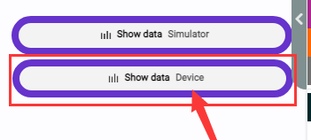
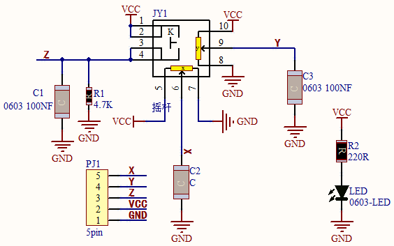
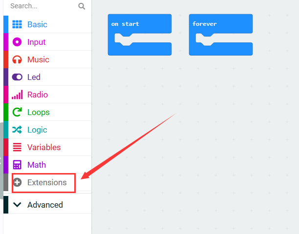

# Micro:bit Excavator Projects

## 1. Projects

[Code Download](./Resources.zip)

 

------------

### 1. Capacitive Touch Module

#### 1.1 Overview

Capacitive touch module is an input component which is widely used in electronic devices such as computers, mobile phones and even home appliances. It converts the physical button operation into electrical signals for recognition and processing. This module is usually composed of a touch switch, a contact pad, a conductive material and a circuit board.

#### 1.2 Schematic Diagram

TTP223N-BA6 is a touch pad detector IC that comes with a touch area. The touch detection IC, with various dimensions, can replace the traditional buttons. Its output mode is related to pins TOG and AHLB.

| TOG  | AHLB |      Optional Function of Pin Q      |
| :--: | :--: | :----------------------------------: |
|  0   |  0   | Direct mode, available at high level |
|  0   |  1   | Direct mode, available at low level  |
|  1   |  0   |  Trigger mode, power-on state is 0   |
|  1   |  1   |  Trigger mode, power-on state is 1   |

From the Schematic Diagram, the pin TOG and AHLB are suspended, so the output of this module is direct mode which is available at high level.

When we touch the area on the module (equivalent to pressing the button), the signal S outputs high and the on-board red LED lights up. We can determine whether the capacitive touch module is working by reading the power level of S terminal.

After powering on, it takes about 0.5 seconds for stabilization. During this period, please do not touch this area, because all functions are disabled at this time and self-calibration is always carried out. The calibration period is about 4 seconds.

------

#### 1.3 Parameters

- Operating voltage: DC 3.3 / 5V
- Operating temperature: -10°C ~ +50°C
- Output signal: digital signal
- Dimensions: 32 x 24 x 7.3 mm
- Positioning hole: diameter of 4.8 mm
- Interface: 3 pin spacing 2.54 mm

------

#### 1.4 Wiring Diagram

------
#### 1.5 Test Code

**Load code:**

Download the code package and unzip it to upload the code to Micro:bit board: [Basic Projects - How to Import Code](https://docs.keyestudio.com/projects/KS0808/en/latest/docs/Microbit/Basic_Courses.html#import-code)

**Build code blocks manually:**

1. In , put  into .

2. In , put  into , and modify the write value to `val:`.
3. In , drag  and set the pin to `P14`, and put this block into the last box of .

4. In , put  under  and set the delay to 100ms.

**Complete code:**

------

**Test result:**

After uploading code, the value of the module will be displayed. For Windows 10 users, you can see the results online with WebUSB.

If WebUSB is disabled, a serial tool may be required. Here we use CoolTerm: [How to install CoolTerm](https://docs.keyestudio.com/projects/KS0808/en/latest/docs/Microbit/Basic_Courses.html#install-coolterm).

Open CoolTerm, click **Options** and choose **SerialPort** to set a correct COM port and set the baud rate to 115200 (the baud rate for USB serial communication is 115200 after testing). Click **OK** and **Connect**.

And you can see the value of the capacitive touch module on the serial monitor. These results will be refreshed every 0.2 seconds.

#### 1.6 Expansion Code

**Load code:**

Download the code package and unzip it to upload the code to Micro:bit board:  [Basic Projects - How to Import Code](https://docs.keyestudio.com/projects/KS0808/en/latest/docs/Microbit/Basic_Courses.html#import-code)

**Build code blocks manually:**

1. In , drag  and put it into .

2. In , add a  as the condition of .

3. Click   to choose , find  and set the pin to `P14` and put this block into the left box of , modify the right box into `1`: that is `P14 = 1`.

4. In , put  into the “then” of .

5. In , put  into the “else” of .

**Complete code:**

**Test result:**

After uploading the code, on-board matrix shows . When the sensor is touched, it becomes . Release the sensor and  is displayed again.

------

### 2. Joystick Module

#### 2.1 Overview

Joystick module is able to control and input signals, which is commonly used for remote control devices, game controllers, and robotics. It detects the displacement and direction to generate corresponding analog signals, so as to control external equipment.

#### 2.2 Schematic Diagram

When the joystick is used as a current regulator in a DC circuit, the current will pass through the arm of the module, and the current will increase due to anodic oxidation. In this case, it is recommended to connect the resistor end to the negative and the arm to the positive. 

If the DC current passes directly through the module, its anode will be oxidated so as to increase its impedance. Therefore, it is best to connect the current negative to the terminal with the carbon diaphragm, and the positive to the terminal with joystick contact piece. 

When it is used as a variable resistor, it is recommended to use as a voltage divider. When adjusting the voltage in a regulator, rotate clockwise to increase output voltage, while rotate counterclockwise to decrease output voltage. Besides, its load resistance RL should not be less than 10 times the nominal resistance RT. 

#### 2.3 Parameters

- Operating voltage: DC 3 ~ 5V 

- Operating temperature:-10°C ~ +50°C

- Dimensions: 47.6MM *23.8MM
- Interface: 5PIN interface
- Analog signal output: signal terminal X, Y
- Digital signal output: signal terminal B

#### 2.4 Wiring Diagram

#### 2.5 Test Code

**Load code:**

Download the code package and unzip it to upload the code to Micro:bit board:  [Basic Projects - How to Import Code](https://docs.keyestudio.com/projects/KS0808/en/latest/docs/Microbit/Basic_Courses.html#import-code)

**Build code blocks manually:**

1. In , put  into .

2. In , click  to choose  and put it under . This is used to turn off LED matrix because the pin of joystick will clash with that of LED matrix.

3. In , put  into , modify the write value to `X`.
4. In , put  into , modify the write value to `Y`.
5. In , put  into , modify the write value to `Z`.

6. In , add  and set the pin to `P10`. Put it into the last box of .

7. In , add  and set the pin to `P4`. Put it into the last box of .
8. In , add  and set the pin to `P13`. Put it into the last box of .

9. In , put  under .

**Complete code:**

**Test result:**

After uploading code, the value of the module will be displayed. For Windows 10 users, you can see the results online with WebUSB.

If WebUSB is disabled, a serial tool may be required. Here we use CoolTerm: [How to install CoolTerm](./Basic_Courses.md#4.2 Install CoolTerm).

Open CoolTerm, click **Options** and choose **SerialPort** to set a correct COM port and set the baud rate to 115200 (the baud rate for USB serial communication is 115200 after testing). Click **OK** and **Connect**.

And you can see the analog and digital values of the joystick module on the serial monitor. These results will be refreshed every 0.1 seconds.

### 3. Servo

#### 3.1 Overview

The servo is a kind of position servo driver, which is mainly composed of housing, circuit board, core-less motor, gear and position detector. The receiver or microcontroller sends a signal to the servo which has an internal reference circuit that generates a reference signal with a period of 20ms and a width of 1.5ms, and compares the DC bias voltage with the voltage of the potentiometer to output voltage difference.

There are many specifications of servos, yet all contains three colors of wires: brown, red and orange. Brown is the grounded, red is the positive, and orange is signal. The wire colors may vary from brands.

The rotation Angle of the servo is controlled by adjusting the duty cycle of the PWM (pulse width modulation) signals. Theoretically, the period of the standard PWM signal is fixed at 20ms (50Hz), so the pulse width should be 1ms ~ 2ms. But in fact, it is 0.5ms ~ 2.5ms, corresponding to the servo angle of  0° ~ 180°.

#### 3.2 Parameters

- Operating voltage: DC 3.3 ~ 5V

- Operating Angle range: approx. 180°(at 500→2500 μsec)
- Pulse width: 500→2500 μsec
- No load speed: 0.12± 0.01sec /60 (DC 4.8V)        0.1± 0.01sec /60 (DC 6V)
- No load current: 200±20mA (DC 4.8V)         220±20mA (DC 6V)
- Stopping torque: 1.3±0.01kg·cm (DC 4.8V)          1.5±0.1kg·cm (DC 6V)
- Stop current: ≦850mA (DC 4.8V)           ≦1000mA (DC 6V)
- Standby current: 3±1mA (DC 4.8V)           4±1mA (DC 6V)

#### 3.3 Wiring Diagram

#### 3.4 Test Code

**Load code:**

Download the code package and unzip it to upload the code to Micro:bit board:  [Basic Projects - How to Import Code](https://docs.keyestudio.com/projects/KS0808/en/latest/docs/Microbit/Basic_Courses.html#import-code)

**Build code blocks manually:**

1. Click  to load the library of servo.

	

2. Search “Servo” and click , and you will see the **Servo** library. Click to load it.

	

3. Successfully loaded.

	

4. In , put  into , and set pin to `P0` and angle to 0 degree.

	

5. In , put  under  and set the delay to 1000ms.

	

6. Repeat step 4 and 5, but set the angle to 90 degree and 180 degree.

**Complete code:**

**Test result:**

After uploading code, the servo rotates from 0 degree to 90 degree and to 180 degree, with a pause of 1 second at each position.

#### 3.5 Expansion Code

Connect the joystick and servo accordingly. In this project, we adopt the joystick module to control the rotation angle of the servo.

**Expansion Code**

1. In , choose  to put  into .
2. In , put  into .

3. In , add a  as the condition of .

4. Click   and find , add a  and set the pin to `P10`, and put it into the left box of , change  to  and modify the right box into `900`: that is `P10 ≥ 900`.

5. In , add  into  and set pin to `P0` and angle to 0 degree.
6. Click  to add another condition. In , add , repeat the above steps to build blocks as follows.

**Complete code:**

**Test result:**

After uploading code, pull the joystick to the left and the servo controls the arm to move left. When you pull it to the right, the arm moves to the right. Release the joystick, and the arm will be back to the middle.

------

### 4. Excavator

#### 4.1 Overview

Let’s build an excavator with capacitive touch sensors, a joystick and servos.

#### 4.2 Wiring Table

|         Module          |     GND     |    VCC    |          S           |
| :---------------------: | :---------: | :-------: | :------------------: |
| capacitive touch sensor | GND (black) | 3V3 (red) | P14 / io19 (yellow)  |
| capacitive touch sensor | GND (black) | 3V3 (red) | P15  / io23 (yellow) |
|     servo 1 (base)      | GND (brown) | 3V3 (red) | P0  / io12 (yellow)  |
|      servo 2 (arm)      | GND (brown) | 3V3 (red) | P2  / io32 (yellow)  |
|    servo 3 (bucket)     | GND (brown) | 3V3 (red) | P1  / io14 (yellow)  |

|  Module  | GND  | VCC  |     X      |     Y     |     B      |
| :------: | :--: | :--: | :--------: | :-------: | :--------: |
| joystick | GND  | 3V3  | P10 / io26 | P4 / io27 | P13 / io18 |

#### 4.3 Test Code

ATTENTION PLEASE! Calibrate the servo angles first before installation! Otherwise servos may burn out!

Download the code package and unzip it to upload the code to Micro:bit board:  [Basic Projects - How to Import Code](https://docs.keyestudio.com/projects/KS0808/en/latest/docs/Microbit/Basic_Courses.html#import-code)

**Build code blocks manually:**

1. Turn LED matrix off first. 

	Define three variables named `x`, `y`, `z` respectively, and set the initial value of `x` to `90`, `y` to `180`, `z` to `180`. 

	Define the initial state of the excavator: base (P0) is `x`, arm (P2) is `y`, and bucket (P1) is `z`.

2. Read the analog value of pin `P10` is greater than `900`. If yes, `x` minus 1 and limit `x` within 0 to 180, and set `P0` servo angle value to `x`. 

   If `P10` is not greater than `900`, determine whether `P10` is lower than `100`. If yes, `x` add 1 and limit `x` within 0 to 180, and set `P0` servo angle value to `x`. 

   

3. If the analog value of pin `P10` is not less than `100`, determine whether `P4` is greater than `900`. If yes, `y` add 1 and limit `y` within 0 to 180, and set `P2` servo angle value to `y`. 

	If `P4` is not greater than `900`, determine whether it is less than `100`. If yes, `y` minus 1 and limit `y` within 0 to 180, and set `P2` servo angle value to `y`.

4. If the analog value of pin `P4` is not less than `100`, determine whether the digital value of `P14` is equal to `1`. If yes, `z` add 1 and limit `z` within 0 to 180, and set `P1` servo angle value to `z`. 

	If `P14` is not equal to `1`, determine whether `P15` = `1`. If yes, `z` minus 1 and limit `z` within 0 to 180, and set `P1` servo angle value to `z`.

**Complete code:**

------

## 2. Troubleshooting

### 1. Code fails to download to Micro:bit

#### Problem

Recently, many users encounter the issue that Micro:bit board doesn’t respond when download code.

If the way you operate is correct, maybe you accidentally press the reset button and enter the Maintenance mode or the firmware is lost due to mis-operation.

Plug in Micro:bit board, the “MAINTENANCE” drive appears, which means the program can’t be downloaded.

#### Solution

1. Download the **hex file** from this page to your computer.

	Down load the latest micro:bit firmware-0255: https://www.microbit.org/get-started/user-guide/firmware/ 
	If you do not want to download from this website, we also provide it in our tutorial.

2. After the latest firmware is downloaded, then drag it into the “MAINTENANCE” to make Micro:bit back to normal mode.

#### Avoid to Enter “MAINTENANCE”

1. Make sure the Reset button is **not** pressed when plugging the board by USB cable.

  
        

2. Don't unplug the cable suddenly during downloading micro:bit program, otherwise, the firmware will be lost and micro:bit will enter “MAINTENANCE” mode.
3. In the experiment, wrong wiring also cause a short circuit or firmware lost.

------

### 2. Troubleshooting-Download with WebUSB

Having trouble pairing the Micro: bit with WebUSB (/ device/usb/webusb)?

#### Step 1: Check cable

Make sure that your micro:bit is connected to your computer with a micro USB cable. You should see a **MICROBIT** drive appear in Windows Explorer when it’s connected.

**If you can see the MICROBIT, please go to step 2**.

If you can’t:

- Make sure that the USB cable is working. Does the cable works on another computer? If not, find a different cable to use. Some cables may only provide a power connection and don’t actually transfer data.
- Try another USB port on your computer. 
- Is the cable good but you still can’t see the **MICROBIT** drive? Hmm, you might have a problem with your micro:bit. 
- Try the additional steps described in the [falut finding](https://support.microbit.org/support/solutions/articles/19000024000-fault-finding-with-a-micro-bit) at microbit.org.
- If this doesn’t help, you can create a [support ticket](https://support.microbit.org/support/tickets/new) to notify the Micro:bit Foundation of the problem. If you do so, **skip the rest of these steps**.

------

#### Step 2: Check firmware version

It’s possible that the firmware version on the micro:bit needs an update. Let’s check:

1. Go to the **MICROBIT** drive.

2. Open the **DETAILS.TXT** file.

	

3. Look for the version number. It should say **Version: ...**

	

	Or **Interface Version: ...** 

	

If the version is **0234**, **0241**, **0243**, you need to update the firmware on your micro:bit. Go to **Step 3** and follow the upgrade instructions.

If the version is **0249**, **0250** or higher, you have the right firmware, just go to **step 4**.

------

#### Step 3: Update firmware

1. Put your micro:bit into **MAINTENANCE Mode**. 

	To do this, please unplug the USB cable from the micro:bit and then re-connect the USB cable after pressing and holding the reset button. Once you insert the cable, you can release the reset button. You should now see **MAINTENANCE** instead of the **MICROBIT** drive. Also, a yellow LED indicator will stay on. 

2. Download firmware .hex file: <https://microbit.org/guide/firmware/>
3. Drag the file into the **MAINTENANCE** drive.
4. The yellow LED will flash while the HEX file is copying. After that, the LED will go off and the micro:bit resets. The **MAINTENANCE** drive now changes to **MICROBIT**.
5. The upgrade is complete! You can open the **DETAILS.TXT** file to check the firmware version that matches the one of the **HEX** file you copied.

If you want to know more about connecting the board, MAINTENANCE Mode, and upgrading the firmware, please refer to [Firmware guide](https://microbit.org/guide/firmware/).

------

#### Step 4: Check version of Browser

WebUSB may require you to update your browser. 

Check that your browser version matches one of these: **Android**, **Chrome OS**, **Linux**, **macOS** and **Windows 10 Chrome 65+**.

------

#### Step 5: Pair device

Once you’ve updated the firmware, open the **Chrome Browser**, go to the editor and click on **Pair Device** in settings. 

See [WebUSB (/ device / usb / webusb) for pairing instructions](https://microbit.org/get-started/user-guide/web-usb/). 

------

## 3. Resources

Keyestudio official:

[https://www.keyestudio.com/](https://www.keyestudio.com/)

Keyestudio wiki main page:

[https://wiki.keyestudio.com/Main_Page](https://www.keyestudio.com/)

MicrobitCode:

<https://makecode.microbit.org/>

Microbit official:

<https://www.microbit.org/>